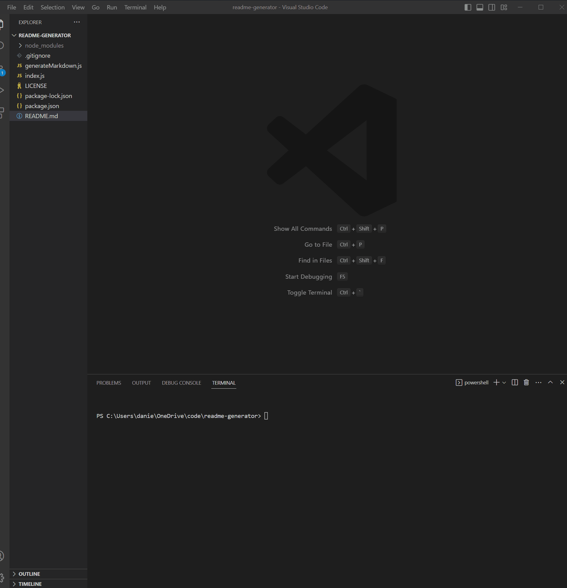

# README generator

## Description
This application generates a README.md file using user input. Using NodeJS as its runtime environment, the application will walk the user through a series of questions. The answers to these questions will be used to generate the README.md. The reason for developing this application is to expidite the process of creating REAMDE files for applications. Now as the user I can quickly generate proper README files by running this application.

This project uses the Inquirer library (https://github.com/SBoudrias/Inquirer.js) for interactive command line interface. 

This page is deployed on GitHub pages: 
https://danielschris96.github.io/readme-generator/

## Usage

In order to use this application, the user will need NodeJS installed.  
After cloning the repository, 
run  `$ npm install` to install the inquirer dependency. Then run `$ node index.js` to start the application. Answer the given questions and a READMEnew.md file will be created. The file name is meant to not overwrite any existing README.md file present.

## Credits

https://opensource.org/ 
https://www.gnu.org/ 
https://img.shields.io/ 
https://www.w3schools.com/java/java_switch.asp 

## License

This project is licensed under the [MIT](https://opensource.org/licenses/MIT) license.